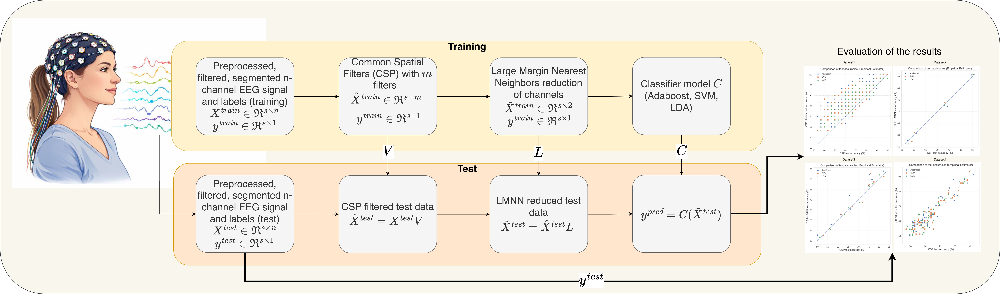
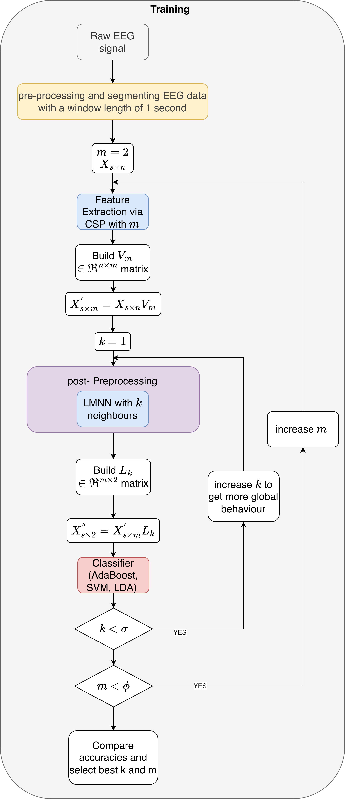

# metric-bci
Application of metric learning on CSP feature space. Common Spatial Patterns (CSP) is a widely used technique for EEG feature extraction, yet it often struggles with noise sensitivity and limited locality preservation. This work introduces a lightweight pipeline that enhances CSP representations using Large Margin Nearest Neighbors (LMNN), a metric-learning approach that preserves local neighborhood structure in a low-dimensional space. CSP features are first extracted and then mapped via LMNN to improve discriminability and robustness.

Experiments on three MI-EEG datasets show consistent test-accuracy improvements for most participants, with the largest gains observed on Dataset 1 (≈10% increase in mean α-band accuracy across AdaBoost, SVM, and LDA). The improvements are particularly pronounced for low-accuracy subjects (baseline < 60%), as confirmed by paired Wilcoxon signed-rank tests (p < 10⁻⁶).

Overall, the CSP+LMNN pipeline provides a computationally efficient and interpretable solution, making it a practical candidate for real-world BCI applications.
## 📚 Citation

If you use this work, please cite:

```bibtex
@article{balli2026,
  title={Improving Motor Imagery based BCI through Metric Learning},
  author={Balli, T., Yetkin, E. Fatih},
  journal={Biomedical Signal Processing and Control},
  year={to be appeared}
}
```



The algorithmic framework of the code can be seen as follows: the main theme is the application of metric learning approach (LMNN) on CSP feature space in EEG. 

<p align="center">
  
</p>

## 🔧 How to use?

This repository provides a modular Python package for applying metric learning (LMNN) on CSP-based EEG features for motor imagery (MI) BCI. It currently supports **three** motor-imagery datasets through a unified API. The sections below are written so that you can **clone the repo, follow the steps in order, and run the code from scratch** on a new machine.

**Checklist for first run:** (1) Clone repo → (2) Create environment (conda or venv) → (3) `pip install -r requirements.txt` → (4) Run the Quick start code in Section 4 from the repo root. Dataset1 is auto-downloaded; if that runs without errors, the setup is correct.

---

### 1. Installation

**Step 1.1: Clone and enter the project**

Clone the repository and enter the project directory (all later commands must be run from this directory):

```bash
git clone https://github.com/bcifeast/metric-bci.git
cd metric-bci
```

**Step 1.2: Create and activate the environment**

We recommend using **conda** to manage the environment and avoid package conflicts:

```bash
conda create -n metric_learning_env python=3.11 -y
conda activate metric_learning_env
```

**Step 1.3: Install dependencies**

Install dependencies with **pip** inside the activated environment (exact versions are in `requirements.txt`):

```bash
pip install -r requirements.txt
```

**Alternative to conda (using Python’s venv:** If you prefer a virtualenv instead of conda:

```bash
python3.11 -m venv .venv
source .venv/bin/activate   # Linux / macOS
# or:  .venv\Scripts\activate   on Windows
pip install -r requirements.txt
```

**Optional:** To use Jupyter Notebooks with this environment, register it as a kernel:

```bash
python -m ipykernel install --user --name metric_learning_env --display-name "Python (Metric Learning)"
```

**Important:** From now on, always run Python or Jupyter from the **repository root** (the folder that contains `metric_bci`). If you run from another directory, `import metric_bci` will fail.

### 2. Required libraries

The project depends on specific library versions for reproducibility and to avoid known conflicts (e.g. with numpy≥2.0 and scikit-learn≥1.6). The following are listed in `requirements.txt`:

| Package       | Version  |
|---------------|----------|
| numpy         | 1.26.4   |
| scipy         | 1.11.4   |
| scikit-learn  | 1.5.2    |
| mne           | 1.7.1    |
| pandas        | 2.2.2    |
| matplotlib    | 3.8.4    |
| seaborn       | 0.13.2   |
| openTSNE      | 1.0.2    |
| pyriemann     | 0.6      |
| metric-learn  | 0.7.0    |
| joblib        | 1.4.2    |
| tqdm          | 4.66.5   |
| ipykernel     | 6.29.5   |

Do **not** install **moabb**, **numpy≥2**, or **scikit-learn≥1.6** in this environment; they can cause dependency or compatibility issues.

### 3. Datasets and citation

The pipeline does **not** require you to use a specific dataset. What matters is that your data matches the **expected input format** (see below). Out of the box, the code supports **three** motor-imagery EEG datasets: **Dataset 1** is downloaded automatically (via MNE); **datasets 2 and 3** must be downloaded by you from the original sources and placed under `metric_bci.config.DATA_DIR`. Raw or processed data files are not included in this repository and should be excluded from version control (e.g. via `.gitignore` for `.mat`, `.edf`, `.csv`). When using those three datasets in publications, the citations below are required.

| Code name   | Description / source | How to obtain | Citation / license |
|------------|----------------------|---------------|--------------------|
| **dataset1** | PhysioNet EEG Motor Movement/Imagery | Fetched automatically by MNE when `load_dataset("dataset1", ...)` is called. *MNE stores it in your home directory (e.g. `~/mne_data`), not in the repository.* | Cite: Schalk et al., BCI2000, IEEE TBME 51(6):1034–1043, 2004; and PhysioNet (Goldberger et al., Circulation 101(23), 2000). Data: [Open Data Commons Attribution License v1.0](https://physionet.org/content/eegmmidb/1.0.0/). |
| **dataset2** | BCI Competition IV, Data set 1 (Berlin BCI) | Download from the official source. Listed under “External links” at [BNCI Horizon 2020](http://bnci-horizon-2020.eu/database/data-sets); see also [BCI Competition IV](https://www.bbci.de/competition/iv/). Place files under the path given by `metric_bci.config.DATA_DIR` as expected by `load_dataset` (see `datasets.py`). | License: CC BY-ND 4.0. You must cite the data providers and the competition; see the dataset description on the competition page. Redistribution of processed versions may not be permitted; use original downloads only. |
| **dataset3** | BCI Competition IV, Data set 2a (Graz, 4-class MI) | Same as above; Data set 2a is listed at the top of the [BNCI data sets page](http://bnci-horizon-2020.eu/database/data-sets). | License: CC BY-ND 4.0. Citation and attribution as required by the competition and the dataset providers. |

If you use dataset2 or dataset3, do not redistribute the data in this repo; link only to the official sources and comply with CC BY-ND 4.0.

#### Expected input format (what the library expects)

You do not have to use only these three datasets. The library can work with any motor-imagery EEG data that matches the following format:

- **X (epochs):** A `numpy.ndarray` of shape **`(n_trials, n_channels, n_times)`**.
  - **n_trials:** number of trials (epochs).
  - **n_channels:** number of EEG channels.
  - **n_times:** number of time samples per trial (e.g. 1 second × 250 Hz = 250).
  - Values should be float (e.g. microvolts). Data should be **epoched** (cut into trials around the event of interest). Band-pass filtering can be done before calling the pipeline or inside a custom loader; the built-in `load_dataset` applies it for datasets 1–3.
- **y (labels):** A `numpy.ndarray` of shape **`(n_trials,)`** with integer class labels. The current pipeline assumes **binary classification** (two classes, e.g. 0 and 1).

The built-in `load_dataset(...)` returns `(X_train, y_train, X_test, y_test)` in this format for `dataset1`, `dataset2`, and `dataset3`. To use your own data, either add a new case in `load_dataset` that produces these shapes, or call `CSPLMNNPipeline` / `run_full_experiment` with arrays that follow the same conventions.

### 4. Quick start (first run: dataset1 only)

**Recommended first test:** Run the code below from the repository root (after completing Section 1). Dataset1 is downloaded automatically by MNE on first use (no manual download). This checks that the environment and pipeline work.

Save the code below into a file (e.g. `main.py`) in the repository root and run: `python main.py`, or run the same code in a Jupyter notebook. Do not paste the block into the terminal as-is.

```python
from metric_bci.pipeline import CSPLMNNPipeline
from metric_bci.datasets import load_dataset
from metric_bci.config import FREQUENCY_BANDS

# Load one subject, alpha band (8–12 Hz). Dataset1 is fetched via MNE if needed.
dataset_name = "dataset1"
subject = 1
freq_range = FREQUENCY_BANDS["alpha"]  # (8, 12)

X_train, y_train, X_test, y_test = load_dataset(
    dataset_name=dataset_name,
    subject=subject,
    freq_range=freq_range,
)

# Build pipeline: m_filters = CSP components, k_neighbors = LMNN k
model = CSPLMNNPipeline(
    m_filters=4,
    use_lmnn=True,
    k_neighbors=3,
    classifier="svm",
)

model.fit(X_train, y_train)
accuracy = model.score(X_test, y_test)
print(f"Test accuracy: {accuracy * 100:.2f}%")
```

If this runs without errors and prints a test accuracy, your setup is correct. For **datasets 2 and 3**, you must download the data and place it under the directory given by `metric_bci.config.DATA_DIR` (default: `Datasets/` in the repo root); see the table in Section 3 and the docstring of `load_dataset` in `metric_bci.datasets` for the expected folder layout.

### 5. Running the full experiment grid

To reproduce the paper’s experimental grid (all bands × subjects × CSP component counts × k_lmnn) and save one CSV per band:

```python
from metric_bci.experiments import run_full_experiment, get_subject_list

# Example: dataset1, alpha band only, first 2 subjects (for a quick test)
subjects = get_subject_list("dataset1", max_subjects=2)
saved_files = run_full_experiment(
    dataset_name="dataset1",
    subjects=subjects,
    bands={"alpha": (8, 12)},
    nc_list=(4, 8),
    k_lmnn_range=(1, 5),
    output_dir=".",
)
# Output: CSV files, e.g. csp_lmnn_results_alpha_dataset1.csv
```

Omit `subjects` and `bands` to run over all subjects and all bands defined in `config.FREQUENCY_BANDS`. Use `max_subjects` in `get_subject_list` for shorter runs.

### 6. Using different classifiers

The pipeline supports the built-in classifier names `"svm"`, `"lda"`, and `"ada"`, or any scikit-learn estimator that implements `fit` and `predict`:

```python
from sklearn.ensemble import AdaBoostClassifier
from metric_bci.pipeline import CSPLMNNPipeline

model = CSPLMNNPipeline(
    m_filters=6,
    k_neighbors=5,
    classifier=AdaBoostClassifier(n_estimators=200),
)
model.fit(X_train, y_train)
```

### 7. Parallel processing

Cross-validated hyperparameter search inside the pipeline can use multiple cores via the `n_jobs` parameter:

```python
model = CSPLMNNPipeline(
    m_filters=6,
    k_neighbors=5,
    n_jobs=-1,  # use all available cores
)
model.fit(X_train, y_train)
```

### 8. Project structure

The repository is organized as follows:

```
metric_bci/
├── __init__.py
├── config.py       # DATA_DIR, FREQUENCY_BANDS
├── datasets.py     # load_dataset(dataset_name, subject, freq_range, data_dir)
├── pipeline.py     # CSPLMNNPipeline (CSP + optional LMNN + classifier)
└── experiments.py  # run_full_experiment, get_subject_list
```

- **config.py**: Root path for datasets (`DATA_DIR`) and standard EEG frequency bands (`FREQUENCY_BANDS`).
- **datasets.py**: Single entry point for loading the three motor-imagery datasets; returns `(X_train, y_train, X_test, y_test)` with band-pass filtering applied.
- **pipeline.py**: `CSPLMNNPipeline` implements CSP, optional LMNN, and a configurable classifier with a scikit-learn-style `fit` / `predict` / `score` API; the `evaluate` method runs the full grid over AdaBoost, SVM, and LDA with cross-validated hyperparameter search and returns metrics plus separability.
- **experiments.py**: `run_full_experiment` runs the band × subject × nc × k_lmnn grid and writes one CSV per band; `get_subject_list` returns the subject IDs per dataset.

CSP is provided by **MNE** (`mne.decoding.CSP`), and LMNN by **metric-learn**; both are used inside `CSPLMNNPipeline`. The package does not expose separate `metric_bci.features` or `metric_bci.metric_learning` modules.

### 9. Reproducibility and extensibility

The same experimental protocol (datasets, bands, subjects, CSP/LMNN parameters, classifiers) can be rerun via `run_full_experiment` and the provided notebooks. Configuration is centralized in `config.py`; new bands or data paths can be added there. The pipeline accepts any classifier compatible with scikit-learn’s estimator interface, and the dataset loader in `datasets.py` can be extended for additional datasets that follow the same `(X_train, y_train, X_test, y_test)` format and shapes described in Section 3.

---

## About

Application of metric learning on CSP feature space for motor-imagery BCI.
